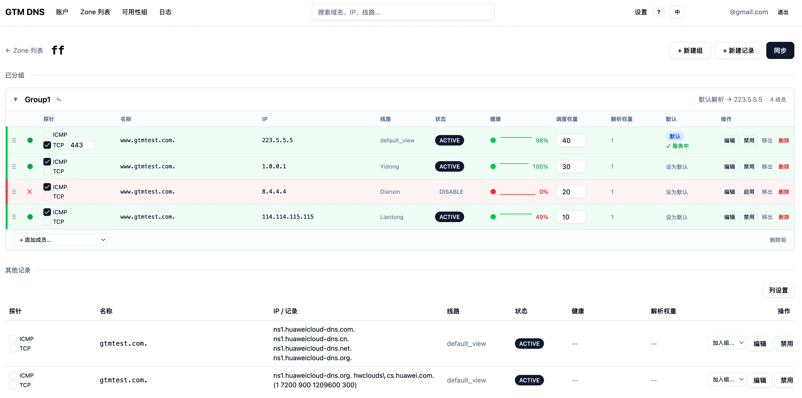
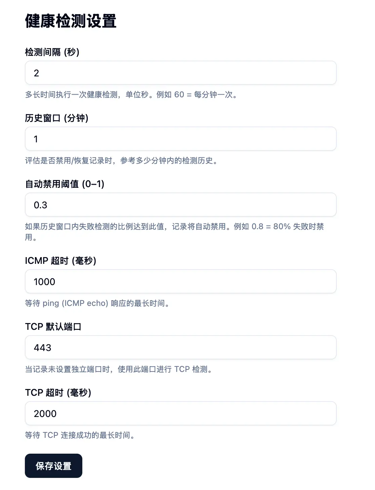
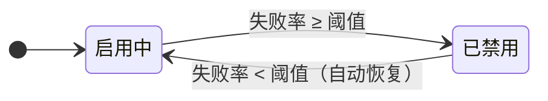
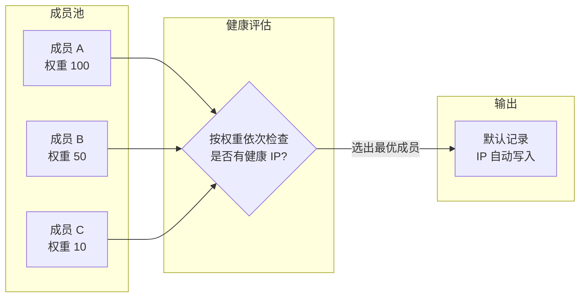
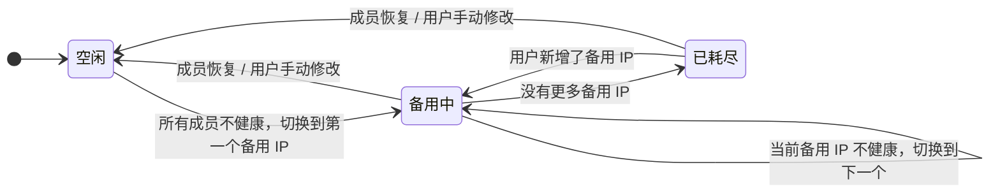

# GTM DNS

**华为云 DNS 全局流量管理平台 — 秒级健康检测 + 智能故障切换 + 多账户统一管理**

- GTM-专线和机场主交流： https://t.me/gtm_iplc
- 通知频道： https://t.me/gtm_dns

### 立即免费使用： https://gtm.hwdns.net

Huawei Cloud DNS Global Traffic Management — sub-second health checks, automatic failover, multi-account unified management.

<p align="center">
  
</p>
<p align="center">
  
  
</p>

---

## 为什么需要 GTM DNS？

华为云控制台的 DNS 管理体验有诸多痛点：

- 页面响应慢，操作卡顿，切换 Zone/记录需要反复等待加载
- 传统 GTM 系统(阿里云)健康检测间隔最低只能设置到 **1 分钟**，故障切换不够及时
- 多个华为云账号需要反复登录切换，无法统一管理


**GTM DNS 解决了所有这些问题。**

---

## 核心特性

### 极致速度

使用 **Go** + **Svelte 5** 构建，所有页面操作即时响应。

- 前端编译为静态 SPA，嵌入 Go 二进制，**单文件部署，零依赖**
- SQLite WAL 模式 + 直接 HTTP 调用华为云 API（无 SDK 开销），查询与操作都在毫秒级完成
- **告别华为云控制台的漫长等待**，所有 DNS 操作都在本平台内秒级完成
- 跨区域全局搜索，在成百上千条记录中快速定位特定域名/IP，直接编辑

### 秒级健康检测

传统 GTM 方案的健康检测间隔最低只能到 1 分钟。**GTM DNS 最低可设置到 2 秒**，故障发现速度提升 30 倍。

- **ICMP + TCP 双重探测**，同时对每个 IP 并行执行，取最快结果
- 自动禁用/恢复：失败率超过阈值自动禁用记录，恢复后自动重新启用
- 可用性组：按权重自动选出最健康的成员，实现 DNS 层面的智能故障切换
- 备用 IP 池：当所有成员均不健康时，按优先级逐一尝试备用 IP，提供最后一道防线

### 大规模并发探测

采用高性能并发架构，**一台 2C2G 的服务器即可同时检测 1 万个 IP**。

| 技术要点 | 实现 |
|---|---|
| 探测并发 | 500 worker 固定大小协程池（可配置） |
| ICMP 探测 | SharedPinger — 单 ICMP socket，sequence number 分路复用 |
| 数据写入 | 1000 行/事务 批量插入 + prepared statement |
| 健康评估 | 单次批量查询预加载缓存，消除 N*M 次数据库查询 |
| 评估并发 | 50 worker 信号量控制（可配置） |

### 多账户统一管理

一个平台账号可管理 **多个华为云账号**，不再需要反复登录切换。

- 华为云 SK 使用 **AES-256-GCM** 加密存储，安全可靠
- 每个账户的数据完全隔离，互不影响

### 全局搜索

在导航栏即可**跨 Zone 搜索域名、IP、线路**，300ms 防抖即时响应，从海量记录中秒级定位目标。

### 中英文双语

完整的国际化支持，一键切换中文 / English。

---

## 架构

```
Go Binary (单文件部署)
  ├── Chi HTTP API  /api/v1/*
  ├── JWT Auth + 多账户数据隔离
  ├── 内嵌 Svelte 5 SPA (go:embed)
  ├── 高性能健康检测引擎
  │     ├── SharedPinger — 单 ICMP socket，seq-based 分路复用
  │     ├── 500 worker 固定大小协程池
  │     ├── 每 IP 的 ICMP + TCP 并行探测
  │     ├── 1000 行/事务 批量写入
  │     └── 单次查询预加载评估缓存
  ├── 可用性组评估器 — 按权重自动故障切换 + 备用 IP 池
  ├── hwdns/ — 华为云 DNS Go 客户端 (直接 HTTP + AK/SK 签名)
  └── SQLite WAL (mattn/go-sqlite3, CGO)
```

### 技术栈

**后端:** Go 1.25 · Chi · SQLite (WAL) · sqlc · robfig/cron · zap · JWT

**前端:** Svelte 5 · SvelteKit · shadcn-svelte · Tailwind CSS v4 · TanStack Query v6

---

## 快速开始

### 1. 获取华为云访问密钥

登录华为云**控制台**，按以下步骤添加访问密钥：

**第一步：点击右上角用户名 → 我的凭证**


**第二步：访问密钥 → 新增访问密钥 → 勾选确认 → 下一步**


**第三步：填写描述 → 确定**


**第四步：立即下载密钥文件**


**第五步：打开下载的 credentials 文件，获取 AK 和 SK**


### 3. 开始使用

1. 访问 `https://gtm.hwdns.net`，注册账号
2. 在「账户」页面添加您的华为云账户（填入 AK 和 SK）
3. 进入账户后，点击「从华为云同步」拉取 DNS Zone 列表
4. 进入 Zone 详情，同步解析记录
5. 为需要监控的记录启用健康检测（ICMP / TCP）
6. 在「可用性组」页面将多条记录组成一个组，并**手动指定默认记录**

> 默认记录一般选择「默认线路（default view）」，当所有线路解析失效的时候，默认线路兜底。

---

## 健康检测

系统按设定间隔对所有启用了 ICMP 或 TCP 探测的记录执行自动检测。



**失败判定**：ICMP 和 TCP 两种探测中，所有**已启用**的探测全部失败，才算该 IP 失败。

在「设置」页可调整：检测间隔、时间窗口、失败率阈值。

---

## 可用性组

将多条解析记录组成一个池，系统自动选出最健康的成员，把它的 IP 写入「默认记录」，实现 DNS 层面的自动故障切换。



**评估规则：**

- 按权重从高到低依次检查每个成员
- 找到第一个**有健康 IP 且状态为启用**的成员，将其 IP 写入默认记录
- 若所有成员均不健康，启动备用 IP 池流程（见下节）

> 默认记录不会被自动禁用。它的 IP 内容完全由可用性组管理，独立于健康检测的禁用逻辑。

### 备用 IP 池

每个可用性组可配置一组备用 IP，当所有成员都不健康时作为最后一道防线。



**工作机制：**

- 每个检测周期尝试一个备用 IP，通过健康检测判断是否可用
- 某个备用 IP 健康后停留在该 IP，直到有成员恢复
- 成员恢复后**自动切回成员**，备用流程结束（成员始终优先于备用 IP）
- 全部备用 IP 耗尽后停止切换；此时如果用户新增了备用 IP，流程会自动继续
- 用户手动修改默认记录 IP 且该 IP 健康时，备用流程自动停止

---

## 变更日志

所有可用性组的 IP 切换都有完整的审计轨迹：

| 事件 | 含义 |
|---|---|
| `MEMBER_DISABLED` | 成员因失败率过高被自动禁用 |
| `MEMBER_ENABLED` | 成员健康恢复，被自动重新启用 |
| `DEFAULT_UPDATED` | 默认记录的 IP 已切换到新的最优成员 |
| `FALLBACK_ACTIVATED` | 所有成员不健康，开始使用备用 IP |
| `FALLBACK_SWITCHED` | 当前备用 IP 不健康，切换到下一个 |
| `FALLBACK_EXHAUSTED` | 所有备用 IP 已耗尽 |
| `FALLBACK_RECOVERED` | 成员恢复或用户手动干预，退出备用模式 |

---

## 常见问题

**Q: 如何修改检测间隔？**
A: 进入「设置」页面修改「检测间隔」，保存后立即生效。

**Q: 记录被自动禁用了怎么办？**
A: 检查对应 IP 的网络连通性，恢复后系统会自动重新启用。

**Q: 为什么默认记录的 IP 没有切换？**
A: 常见原因：
- 所有成员都没有健康 IP（网络故障或探测未启用）
- 最优成员的 IP 与默认记录当前 IP 相同，无需切换
- 成员未启用任何探测（无数据的成员不会被选中）

**Q: 备用 IP 池需要注意什么？**
A: 默认记录必须启用健康检测（ICMP 或 TCP），否则系统无法判断备用 IP 是否健康，备用流程不会启动。

---

## 开源说明

本项目**部分开源**。以下组件以 MIT 协议开源：

- **[`hwdns/`](hwdns/)** — 华为云 DNS API 的 Go 客户端，无需官方 SDK，直接 HTTP + AK/SK HMAC-SHA256 签名
- **[`web/`](web/)** — 基于 svelte 的部分用户前端组件
- **[`readme.md`](readme.md)** — 项目说明文档
- **[`help.md`](help.md)** — 用户帮助文档

核心业务逻辑（健康检测引擎、可用性组评估器、调度器、多租户认证等）不在开源范围内。

## License

MIT (for open-sourced components)
